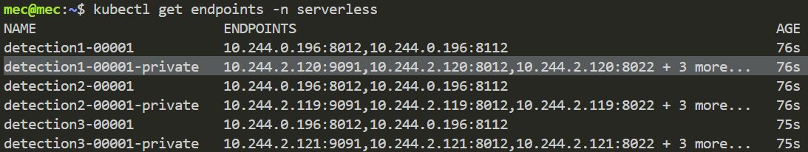

# Availibility

- reaction time: Thời gian kể từ khi process/container/pod bị xóa cho tới khi địa chỉ IP của service bị xóa khỏi danh sách endpoints (Thời gian để Kubernetes phát hiện ra pod bị lỗi)
- recovery time: Thời gian kể từ khi địa chỉ IP của serivice bị xóa cho tới khi địa chỉ IP đó xuất hiện lại trong danh sách endpoints

# Chạy chương trình

```bash
python3 availability.py <Endpoint Name> <pod/container/process>
```

# Lấy Enpoint Name

```bash
kubectl get endpoints -n serverless
```



- Endpoint name dùng để truyền vào command line sẽ có đuôi “-private”

---

- Do sau mỗi lần pod/container bị lỗi, Kubernetes sẽ cập nhật giá trị Crashloopbackoff tăng lên (10s, 20s, 40s,… cho tới khi đạt giá trị tối đa là 300s). Trong khoảng thời gian Crashloopbackoff, pod/container sẽ không được sửa lỗi. Sau khi pod chạy ổn định thì giá trị Crashloopbackoff sẽ được reset về 0.
- Do đó, sau mỗi lần đo thì sẽ phải xóa và triển khai lại service, hoăc là sẽ đợi 10 phút giữa 2 lần đo.

# PID Commands

### Cách lấy PID

- Tìm của conatainer nằm bên trong POD:
    
    ```bash
    crictl ps 
    ```
    
    
    

- Tìm PID sử dụng container ID đã tìm:
    
    ```bash
    pstree -a -p --long | grep <Conainer ID>
    ```
    
    
    
    
    

- Các tiến trình của ứng dụng là tiến trình con của container:
    
    
    
- Tìm PID của container đại diện cho POD tương tự:
    
    
    
    